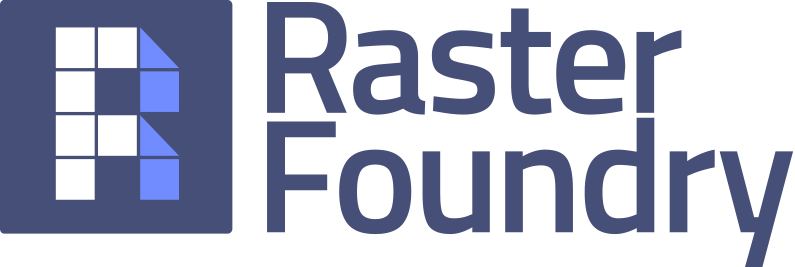
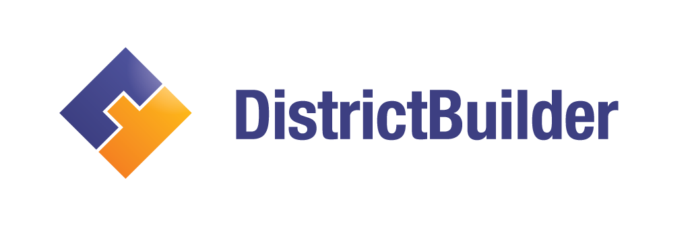
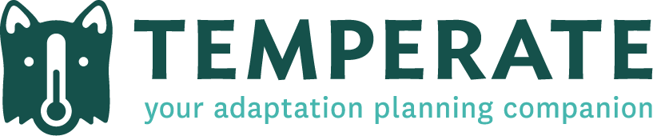

## Cicero
Cicero is a comprehensive database of elected officials and legislative districts. Cicero enables you to match constituents with their representatives based on address-level data, leading to endless possibilities. Always capitalize the first letter of "Cicero". [Go to website](https://www.cicerodata.com/)

## GeoTrellis
GeoTrellis is a geographic data processing engine for high performance applications. [Go to website](https://geotrellis.io/)

## Raster Foundry
We help you find, combine and analyze earth imagery at any scale, and share it on the web. Always capitalize the first letter of each word in "Raster Foundry". It should never be written in upper camel case. [Go to website](https://www.rasterfoundry.com/)

## HunchLab
HunchLab is a web-based proactive patrol management system. When writing its name, it should always be in upper camel case. [Go to website](https://www.hunchlab.com/)

## DistrictBuilder
DistrictBuilder is web-based, open source software for collaborative redistricting. When writing the name, it should always be in upper camel case. [Go to website](http://www.districtbuilder.org/)

## District Match
Fuel your grassroots advocacy campaign, update records in your CRM, or complete targeted mailings in minutes. Simply upload your address spreadsheet and we'll return it stamped with the legislators and districts you need.  Always capitalize the first letter of each word in "Raster Foundry". It should never be written in upper camel case. [Go to website](https://www.cicerodata.com/districtmatch/)

## Temperate
Azavea's app for city-based climate change adaptation planners. Always capitalize the first letter of "Temperate". [Go to website](https://www.temperate.io/)

## OpenTreeMap
Map ecosystem resources like rain barrels, rain gardens, or bioswales, and specify the custom attributes or stewardship activities you want to track. Future development on OpenTreeMap has been suspended. When writing the name, it should always be in upper camel case. [Go to website](https://www.opentreemap.org/)
