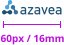
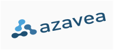
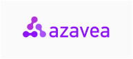
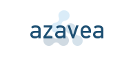
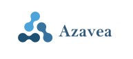

Design guidelines for the Azavea company logo and product logos vary. Refer to [Products](/identity/products.html) to see all of our product logos. Following the design details associated with each logo ensures brand consistency across all communications.

## Assets

### Full color
The Azavea logo consists of two main elements: the icon to the left (internally referred to as the “bones”) and complete wordmark “Azavea”. The color Azavea logo with transparent background is the standard logo option. If it’s not possible to use the standard logo option, one of the other logo variations should be applied (see below).



<a href="/downloads/azavea-full-logo.zip" class="c-btn c-btn--small" download>Download assets</a>

### Background colors
The Azavea color logo should be used whenever possible. However, it may be necessary to use the white logo on a background color in some cases. 

The Azavea logo works best on a white or very light background colors, but does not have a background inherent to the branding. When overlaid atop non-white backgrounds, an effort should be made to provide clarity to the elements of the logo and to overlay atop solid blocks of color. An alternate version is available that inverts the ‘azavea’ type for enhanced contrast on very dark backgrounds. Do not alter the triple-node mark.



<a href="/downloads/azavea-full-logo.zip" class="c-btn c-btn--small" download>Download assets</a>

### Mark
Use the full Azavea logo with wordmark in all cases possible. The triple node mark should be primarily used in social media instances where the full logo does ot work due to size/format restrictions.

  

  

<a href="/downloads/azavea-mark.zip" class="c-btn c-btn--small">Download assets</a>

## Logo Usage

### Minimum Size
The Azavea Logo should not be rendered at a size smaller than 16mm wide at 300dpi when resized proportionally, or 60px for screen display.

  

    
  

### Minimum clearance
Always keep a clear space around the Azavea Logo. The minimum required distance around the perimeter of a rectangle enclosing the Azavea logo is equal to the height of one of the icon&rsquo;s &ldquo;bones&rdquo;.



### Logo don’ts
Neither the Azavea logo nor any of its parts may be augmented or altered in any way apart from resizing. When resizing, take care to constrain proportions and resize the entire logo.

- 
  
    Don’t stretch, tilt or condense the logo
  

- 
  
    Don’t alter any color of the Azavea logo or add any effects (drop shadow, glow, gradient, etc) unless it’s for for social media avatars.
  

- 
  
    Don’t overlay the full-color logo onto an image. Please refer to [Photography](/design/photography.html) for more information.
  

- 
  
    Don’t overlay the full-color logo onto a bright or otherwise low contrast color. Please use the white logo and ensure that contrast is at least 4:8.
  

- 
  
    Don’t alter or partially cover any part of the logo.
  

- 
  
    Don’t use real text for the wordmark.
  
{: .c-list--logo-donts }